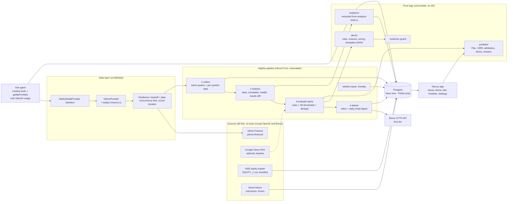

# Nazar v2.0: build plan (revision 2)

> **Nazar watches your stocks every day and messages you only when something important happens, explaining what happened and why, in plain language.**
> *We watch and explain; you decide.*

This plan builds on [AUDIT.md](AUDIT.md).

**Revision 2 changes, from your feedback of 3 Oct 2026:**
1. **Zero paid services.** OpenAI is the only paid API, and it's used only in the Ask tab with the existing daily budgets. Alerts, reports, Hindi text and the demo use no LLM at all. Everything else runs on free tiers (§8).
2. **Nazar becomes the main app.** It's built and tested locally on a working branch, then merged into `main` and deployed on the existing Vercel project. The current StockAI is preserved on a `legacy` branch and deployed as its own "StockAI (legacy)" app, still using its own database (§10).
3. **No Telegram, minimal outside integrations.** Delivery is the in-app inbox plus email through Brevo's free HTTP API, done exactly the way Syncronify does it. The stack follows Syncronify wherever that fits (§7).

Section 11 lists the few remaining questions.

---

## 1. Target architecture

The core change: **pages never call Yahoo**. A nightly pipeline fetches each unique symbol once, stores snapshots in Postgres, runs the existing quant models on the stored data, evaluates alert rules and delivers messages. Pages and the alert engine read only from the database. Only user-initiated Ask questions call the data provider live, and those are already rate-limited.

Modules and responsibilities:

| Module | Contents | Source |
|---|---|---|
| `src/lib/data/` | `MarketDataProvider` and `NewsProvider` interfaces, `YahooProvider`, `resilience.ts` (retry/limit/breaker), `nse-master.ts` | `finance.ts` moved behind the interface, not rewritten |
| `src/lib/analytics/` | Pure `riskReturn`, `correlationMatrix`, `healthScore`, `lenderCheck`, `xirr`, `technicals`, `comps`, `dupont` | **Extracted** from `analysis-tools.ts`. The AI tools become thin wrappers with identical output shapes, so UI views and Excel builders keep working. |
| `src/lib/portfolio/` | Holdings maths, H2 attribution, H3 stress / clusters / concentration, portfolio health weighting | New |
| `src/lib/importers/` | Broker detection + parsers (Zerodha Console/Kite, Groww, Upstox), CSV/XLSX reader, ticker resolver | New (ExcelJS is already a dependency) |
| `src/lib/alerts/` | Rule engine (H1/H4), reason classifier, dedupe, H5 tuner, EN/HI templates, `noAdvice` guard | Replaces today's `alerts.ts`. Price-target alerts become one rule (P2). |
| `src/lib/delivery/` | `InboxChannel` (always), `EmailChannel` (Brevo HTTP API, Syncronify's `mailer.ts` pattern: never throws, logs a preview when unconfigured) | New |
| `src/lib/auth/` | Email + password, 6-digit email OTP verification, password reset (Syncronify's `auth.service.ts` pattern), optional Google | Replaces fingerprint auth |
| `src/lib/pipeline/` | Stage runner, cursor/lock, time budget, self-continuation | Grows out of `api/cron/alerts` |
| `src/lib/demo/` | Fixture loader, seeder, per-visitor demo cloning, bad-day simulator, reset | New |
| `src/lib/db/` | Drizzle schema + **generated migrations** (one source of truth, fixes B-5/B-6), migrator for neon-http / postgres-js / PGlite | Improved |
| `src/components/` | Design-system primitives (`ui/`), feature components (`home/`, `alerts/`, `risk/`…), existing `gen/` views restyled | `App.tsx` split up |

---

## 2. Database schema changes

Nazar runs on a **new, empty database** (a second database inside the existing free Neon project). The legacy app keeps the current database untouched. Migrations are generated by `drizzle-kit` and applied by a cross-platform `npm run db:migrate`. Locally, PGlite is migrated and seeded automatically by `npm run demo`.

**Changed**
- `users`: drop `fingerprint_hash`. Add:
  - `email` (unique, lowercased), `password_hash` (bcryptjs, as in Syncronify)
  - `email_verified_at`, `verify_code_hash`, `verify_expires_at`, `verify_attempts`, `verify_sent_at`
  - `reset_token_hash`, `reset_expires_at`
  - `is_demo`, `demo_expires_at`, `tour_completed_at`
  - `ui_language`, `theme`, `last_seen_at`
- `watchlist` → `watching` (same columns). It reads prices from snapshots.
- `alerts` (price targets) → `price_targets`. Kept for P2 and evaluated by the pipeline.
- `accounts` (OAuth links): kept only if Google stays (Q-B). `events`, `feedback`, `usage`, `rate_events`, `chats`: kept.

**New: portfolio**
| Table | Key columns |
|---|---|
| `portfolios` | id, user_id, name ("Mine", "Papa's"), owner_label, language `en\|hi`, alerts_enabled, is_default, created_at |
| `holdings` | id, portfolio_id, symbol, quantity (numeric), avg_price (numeric), buy_date (nullable), isin, raw_name, source `manual\|zerodha\|groww\|upstox\|screenshot`, created/updated_at · unique(portfolio_id, symbol) |
| `import_batches` | id, portfolio_id, broker, filename, row_count, matched, unmatched jsonb, created_at (audit trail, enables undo of an import) |

**New: market data (shared across users, keyed by symbol)**
| Table | Key columns |
|---|---|
| `instruments` | symbol PK, isin, name, sector, industry, is_financial, source (NSE master / Yahoo), updated_at |
| `price_daily` | (symbol, date, source) PK, close, adj_close, volume · `source` = `live\|demo\|sim` keeps demo and simulated data out of real users' views |
| `symbol_snapshots` | (symbol, trade_date, source) PK, price, prev_close, change_pct, metrics jsonb (43-metric catalog), beta_1y, vol_1y, health jsonb (F-score, Altman, lender check, score 0–100), next_results_date, last_quarter jsonb, fetched_at, status `ok\|stale\|failed` |
| `results_events` | id, symbol, quarter_end, detected_on, source, current/previous figures jsonb, eps_actual, eps_estimate, health_before/after · unique(symbol, quarter_end, source) |

**New: alerts and delivery**
| Table | Key columns |
|---|---|
| `alert_settings` | user_id PK, sensitivity `major\|balanced\|everything`, quiet_mode, email_enabled, per-portfolio overrides jsonb |
| `alert_thresholds` | (user_id, alert_type) PK, value, source `default\|tuned\|manual`, frozen_until |
| `threshold_changes` | id, user_id, alert_type, old_value, new_value, reason jsonb (rating evidence), message_en/hi, created_at, undone_at (the H5 log and undo) |
| `alert_events` | id, user_id, portfolio_id, type, symbol, severity `critical\|important\|info`, trade_date, **dedupe_key unique**, title/body (en + hi), data jsonb (₹ impact, weight, reason class, links), is_simulated, created_at, read_at |
| `alert_feedback` | (alert_id, user_id) PK, rating `up\|down`, reason, source `app\|email`, created_at |
| `recipients` | id, user_id, portfolio_id (nullable = account owner), email, language, verified_at, unsubscribed_at |
| `deliveries` | id, item (alert digest or report), recipient_id, status `sent\|failed\|skipped_no_config\|skipped_cap`, attempts, error, sent_at · unique(item, recipient) |
| `reports` | id, portfolio_id, week_start, language, content jsonb, created_at · unique(portfolio_id, week_start, language) |
| `pipeline_runs` | id, kind `nightly\|weekly\|maintenance`, run_date, stage, cursor, status, stats jsonb, errors jsonb, locked_until, started/finished_at |

---

## 3. Page map

| Route | Purpose | Hero features reachable in one tap |
|---|---|---|
| `/` | Landing (signed out): pitch, the six hero features shown visually, **"Try the demo, no sign-up"**, sign in. Signed-in users are redirected to `/home`. | All six, as previews |
| `/signin`, `/signup`, `/verify`, `/forgot`, `/reset` | Email + password with a 6-digit email code (Syncronify flow); Google if enabled | — |
| `/home` | Portfolio X-ray: hero value with odometer, today's ₹/%, **H2 line**, unrealised P&L, XIRR vs Nifty, health ring gauge, "What needs your attention", sector allocation, holding cards, portfolio switcher (Mine / Papa's), "Nazar is watching · 14 stocks · last check 4:47 PM", **Simulate a bad day** (demo) | H1 (attention list), H2 (line → `/home/today`), H3 (ring → `/risk`), H4 (attention card), H5 (learned-threshold card in attention), H6 (switcher) |
| `/home/today` | H2 breakdown per holding: market vs stock-specific | — |
| `/alerts` | Inbox: story-style cards on mobile, feed on desktop, filter by portfolio, 👍/👎 | H1, H4, H5 messages |
| `/alerts/[id]` | Alert detail: what happened, likely reason, ₹ impact, links to analysis | — |
| `/risk` | H3: stress slider, "less diversified than it looks" clusters, concentration by stock and sector | — |
| `/portfolio` | Portfolios, holdings table, "Watching" list, add/edit/delete | — |
| `/portfolio/import` | Upload CSV/XLSX → auto-detect broker → preview with flagged unmatched rows → confirm | — |
| `/portfolio/[id]/settings` | Name, "whose portfolio", language, the recipient's email, alerts on/off | H6 |
| `/stock/[symbol]` | Price chart, results card (H4), health history from snapshots, risk/valuation vs peers, technicals, past alerts, Excel download | H4 |
| `/reports/[id]` | Weekly report in EN or HI (H6 preview, identical to the email) | H6 |
| `/ask` | Existing agent + `getMyPortfolio`, Simple/Pro, trust panel, share/Excel/PDF | — |
| `/ask/research` | Tools catalog | — |
| `/settings` | Alert sensitivity, email on/off, quiet mode, per-portfolio toggles, **auto-tuned thresholds with Undo (H5)**, theme, language, model (Auto default), restart tour, sign out, delete account | H5 |
| `/r/[token]` | One-click "Was this useful? Yes / No" from emails (signed token, no sign-in needed) | H5 input |
| `/s/[shareId]` | Shared chat (kept) | — |
| `/design` | Style guide: every token and component in both themes | — |
| `/insights` | Admin-only analytics (`ADMIN_EMAILS`) | — |

Navigation: bottom tab bar on mobile (Home, Alerts, Ask, Portfolio, Settings) with bottom sheets; slim sidebar on desktop.

---

## 4. How existing modules are reused

| Existing | v2 use |
|---|---|
| `finance.ts` (quotes, history, metrics, statements, FX) | Becomes `YahooProvider`. The 43-metric catalog feeds per-stock cards, valuation vs peers and tooltips. |
| `analysis-tools.ts` `getRiskReturn` maths | Beta and volatility per holding (H3a stress, H1 market-vs-stock reason), computed from stored daily prices vs `^NSEI`. Replaces Yahoo's unreliable beta. |
| `getCorrelationMatrix` maths | H3b clusters across *all* holdings: the pure version lifts the 8-symbol cap. |
| `getFinancialHealthScore` (Piotroski + Altman) | Per-stock health → portfolio health ring. H4 health before/after. |
| `runComparableValuation` | "Valuation vs peers" chip on holding cards, computed nightly against a fixed sector peer set. |
| `xirr()` | Portfolio XIRR and Nifty comparison. Adds a bisection fallback because Newton's method can diverge. |
| `getTechnicalIndicators` | "Trend" chip on holding cards (above/below 200-day average), in plain language. |
| `getEarnings` / `getNews` | H4 inputs and H1 company-specific context. |
| `searchTicker` NSE preference | Last-resort fallback in the import resolver. |
| `excel.ts` | Stock detail page and Ask. |
| `gen/*` views | Restyled to tokens and reused in Ask and on the stock page. |
| `guard.ts`, `limits.ts`, `models.ts` | Ask tab unchanged (the only OpenAI usage). `limits.ts` also caps the demo, Simulate, import and auth endpoints. |
| `format.ts` (₹, crore/lakh) | Everywhere. `upDown()` switches to semantic tokens. |
| `insights.ts`, `analytics.ts` | Extended with alert metrics (§9). |
| System prompt advice rules | Shared `ADVICE_RULES` constant, used by the Ask prompt and enforced on templates via the `noAdvice` guard. |
| **From Syncronify** | `mailer.ts` (Brevo HTTP API, never throws, dev preview), the auth service pattern (bcryptjs, hashed 6-digit OTP with TTL, attempt limit and resend cooldown, hashed reset tokens, `EXPOSE_VERIFICATION_CODES` dev fallback), the HTML email template approach, `next-themes`, `sonner`, `motion`, `clsx` + `tailwind-merge` |

---

## 5. How each hero feature works

### H1. Smart alerts that explain why and show your ₹ impact

**Rules**, evaluated per portfolio after each nightly collect. Thresholds come from the sensitivity preset, then any H5 tuning.

| Rule | Major | Balanced (default) | Everything |
|---|---|---|---|
| Big stock move (absolute day %) | ≥ 6% | ≥ 4% | ≥ 2.5% |
| …and material to *this* portfolio | impact ≥ 0.5% of portfolio | ≥ 0.25% | any |
| Whole-portfolio move | ≥ 3% | ≥ 2% | ≥ 1% |
| Results out (H4) | always | always | always |
| Health score change | Altman zone change | + F-score Δ ≥ 2 | + F-score Δ ≥ 1 |
| Concentration crossing (stock / sector weight) | 30% / 50% | 25% / 40% | 20% / 35% |
| Results in the next 3 trading days | weekly report only | ✓ | ✓ |

**Likely reason** (deterministic classifier, unit-tested). Inputs: stock return *r*, Nifty return *m*, the stock's sector-index return *s* (sector → `^CNXIT`, `^NSEBANK`, `^CNXAUTO`…), and beta *β* from stored prices.
1. **Whole market:** |m| ≥ 1%, same sign as r, and |r − βm| < 0.5|r|. *"The whole market fell today (Nifty −2.1%). Tata Motors fell about as much as it usually does on days like this."*
2. **Sector-wide:** s has the same sign and |s| ≥ 0.6|r|. *"Most IT stocks fell today (Nifty IT −4.8%)."*
3. **Results:** results were detected within the last 2 trading days. Links to the H4 card.
4. **Company-specific:** otherwise. *"Infosys fell far more than the market (−0.4%) and its sector (−0.9%), so this is likely about the company itself."* Plus, if enabled (Q-C), up to 2 recent headlines as source links.

The copy always says "likely", and the reason class is stored for analytics. The reason works fully without any news source.

**₹ impact:** `qty × (close − prev_close)` and weight = value ÷ portfolio value. *"Tata Motors is 22% of your portfolio; your value fell ~₹8,400 today."*

**De-duplication:** unique `dedupe_key` = `portfolio:type:symbol:trade_date`. Results use the quarter end. Concentration uses crossing episodes with 3-percentage-point hysteresis. At most 5 alerts per portfolio per day; the rest roll into one digest alert. Re-running the pipeline never duplicates, enforced by the database constraint.

**Severity:** *critical* = ≥ 2× threshold, ≥ 1% of portfolio value, or Altman distress. *important* = rule met. *info* = upcoming events. Each level has a distinct icon *and* shape (filled ring / half ring / dot), so it isn't colour-only. Quiet mode emails only critical alerts.

**Email delivery within the free tier:**
- **One digest email per recipient per day**, not one email per alert. Brevo's free tier allows 300 emails/day.
- A configurable global cap (default 250/day) leaves headroom for sign-up codes. Anything over the cap is marked `skipped_cap`; it is still in the inbox and flagged in /insights.

**Feedback:** 👍/👎 in-app, and one-click "Useful? Yes / No" links in every email (signed, single-use, no sign-in needed). Stored in `alert_feedback`, feeding H5 and the North Star.

### H2. "Why did my portfolio move today?"

- `contribution_i = qty_i × (close_i − prev_close_i)` and `total = Σ contribution_i`.
- Pick the smallest set of holdings (max 3), moving in the total's direction, that explains ≥ 60% of the move.
- Examples:
  - *"You're down ₹8,012 today (−1.4%). ₹6,240 of that came from Tata Motors and Infosys."*
  - Mixed day: *"You're up ₹1,200 today. Infosys added ₹3,000; HDFC Bank took away ₹1,500."*
  - Flat (<0.1%): *"A quiet day: your portfolio barely moved."*
- **Breakdown:** each holding's bar is split into *market part* (β × m × value) and *stock-specific part* (the remainder): *"₹5,100 of today's fall was the market; ₹2,900 was specific to your stocks."*
- Reads only today's and yesterday's snapshots. Tests cover gainers/losers mix, single-holding, zero-holding and missing-price cases.

### H3. Hidden-risk checks (`/risk`)

**(a) Stress test**
- `loss_i = value_i × β_i × shock`, with the slider from Nifty −5% to −30%.
- β = 1-year daily regression vs `^NSEI` (the `getRiskReturn` maths), Blume-adjusted (0.67β + 0.33) and clamped to [0, 2.5]. Missing β defaults to 1.0 and is flagged.
- Shows total ₹ and %, per-holding contributions, and portfolio β in words: *"Your portfolio usually moves about 1.1× the Nifty."*
- Labelled as an estimate: *"In real crashes stocks tend to fall together, so losses can be larger."*

**(b) "Less diversified than it looks"**
- Correlation matrix of 1-year daily returns across all holdings.
- Clusters are found by average-linkage hierarchical clustering cut at ρ ≥ 0.6 (pure function, tested on synthetic matrices).
- *Effective number of independent bets* = 1 ÷ (wᵀ C w), between 1 and N.
- Example: *"You own 14 stocks, but they behave like about 6 independent bets. Your 5 bank stocks (38% of your money) tend to move together."*

**(c) Concentration:** top stock, top-3 and per-sector weights against thresholds, plus a Herfindahl score. These also feed the inner ring.

**Health ring gauge (Home)**
- **Outer ring = portfolio health:** value-weighted average of per-stock scores, with coverage shown ("12 of 14 scored").
- Per-stock score:
  - Non-financials: 60% Piotroski (F ÷ scored tests) + 40% Altman zone (Safe 100 / Grey 55 / Distress 15).
  - Banks/NBFCs: a labelled **"lender check"** of 4 tests — ROE ≥ 12%, ROA ≥ 1% (banks) or ≥ 2% (NBFCs), profit growth > 0, revenue growth > 0 — because Piotroski and Altman don't apply to them (B-8).
- **Inner ring = diversification and risk:** effective bets, the concentration penalty and portfolio β, combined into 0–100.

### H4. Results-day explainer

- **Detection:** the nightly collect stores `earningsHistory` + `earnings.financialsChart.quarterly`. When a quarter end appears that wasn't in yesterday's snapshot, we insert a `results_events` row and emit an alert. Detection may trail the exchange filing by a day.
- **Card:**
  - *What improved* / *What got worse*: revenue and profit vs the previous quarter (and vs the same quarter last year once history exists), EPS vs analysts' estimate, operating margin when the quarterly row is complete.
  - *Health score:* Piotroski/Altman are annual, so after Q1–Q3 the card says *"Health score 7/9, unchanged; it updates with full-year results"*. After Q4 results it shows the real before → after (accepted recommendation from rev. 1, Q3).
- Plain language from templates, for example: *"Revenue grew 3.9% from last quarter. Profit fell 8.6% and came in below what analysts expected."*
- Shown in the attention list, the alert, and on `/stock/[symbol]`.

### H5. Alerts that learn

Rule-based and explainable on purpose (see DECISIONS.md).

- **Data:** per user × alert type, the last 10 rated alerts in 90 days.
- **Magnitude types** (stock move, portfolio move, concentration): find the smallest step *T* on a ladder (e.g. 2.5 → 4 → 5 → 7 → 10%) such that:
  - alerts **below** T were rated useful ≤ 40% of the time (n ≥ 3), and
  - alerts **at or above** T were rated useful ≥ 60% (or there are too few to say).

  If T is above the current threshold, raise it to T.
- **Non-magnitude types** (upcoming results): useful ≤ 25% with n ≥ 4 mutes the type. It still appears in the weekly report.
- **Guardrails:**
  - It never lowers a threshold automatically; it only suggests.
  - 14-day cooldown between changes; ladder caps.
  - Undo restores the previous value and freezes tuning for that type for 30 days.
- **Messaging:**
  - An inbox card plus a line in the next email: *"You found small-move alerts less useful, so I'll only alert you for moves above 5%."* with **[Undo]**.
  - Settings lists every tuned threshold with its evidence ("4 of your last 5 alerts under 5% were marked not useful") and Undo.
- **Metric:** usefulness rate of that type in the 30 days before vs after a change (§9).

### H6. Family portfolios with Hindi reports

- **Portfolio settings:** each portfolio has `owner_label` ("Papa"), `language` (`en`/`hi`) and an optional recipient **email**. The recipient confirms once by clicking a link (consent, and protection against spamming third parties), and every email carries a one-click unsubscribe.
- **Routing (pure function, tested):**
  - The account owner always gets everything in the in-app inbox, and their own email digest if enabled.
  - The portfolio's recipient gets the weekly report plus alerts of severity ≥ important, in the portfolio's language.
  - Quiet mode, per-portfolio on/off and the daily email cap apply.
- **Weekly report (Sunday):**
  - Performance vs Nifty
  - Top movers and ₹ contribution
  - What changed: alerts, health changes, results
  - What's coming next week: results dates
- **Rendering:** stored per language in `reports` and rendered identically in-app (`/reports/[id]`) and by email. Hindi uses simple, everyday words with company names in English and ₹ in Indian format, set in Noto Sans Devanagari. Please proofread the Hindi templates, since you're the native speaker. Hindi templates pass the same `noAdvice` guard, which has a Hindi word list (खरीदें, बेचें, होल्ड, लक्ष्य मूल्य, स्टॉप लॉस…).

### DEMO. "Simulate a bad day in the market"

- **Data:**
  - A committed fixture captured once by `scripts/demo/capture-fixture.mjs`: ~120 trading days of **real** prices, quarterly results and fundamentals for ~20 NSE stocks + Nifty + sector indices.
  - The seeder **shifts dates** so the last session is the most recent weekday. The demo always feels current, works with Yahoo down, and the UI labels it "Demo data".
- **Demo account** (per visitor, cloned from a template, isolated, expires after 24h):
  - **"Mine"**, 14 stocks. Five banks/financials form the correlated cluster, alongside an IT pair, autos, FMCG and others.
  - **"Papa's"**, 6 dividend-heavy stocks, Hindi.
  - 60 days of snapshots.
  - ~12 past alerts with ratings, including **the learned-threshold message** from 9 days ago.
  - **A results-day card** using a real recent quarter, dated yesterday.
  - **Last Sunday's Hindi weekly report** for Papa's portfolio.
- **Simulate:**
  - Pick a preset scenario: global sell-off (Nifty −3.2%, IT −5%), rate shock (banks −4%), or a company-specific shock (one holding −8% on a flat market).
  - Generate a synthetic session: `last × (1 + βm + sector shock + small seeded noise)`, written as `source='sim'` for that demo user only.
  - Run the **real** alert engine and delivery on it. Home shows a "Simulated bad day" banner with **Back to normal** (reset).
  - Simulated alerts are badged **SIMULATION** and never invent news. The company-specific reason says what the data shows and notes that real alerts would show headlines here.
- **Optional email:** the visitor can send the simulated digest to their own email. Capped at 1 per address/day and 3 per IP/day, with fixed content and a "you asked for this demo email" footer.
- **Guided tour:** 7 steps (H2 line → an H1 alert → H3 ring/stress → H4 card → H5 message → H6 switcher and Hindi report → Simulate button). Skippable, stored in `tour_completed_at`, restartable from Settings, keyboard-accessible.
- **Limits:**
  - Demo creation 10 per IP/day; Simulate 5 per demo/day.
  - Ask in the demo is limited to 5 questions to cap OpenAI spend.
  - Demo users can never see or affect real users: separate rows plus `source` isolation.

---

## 6. Other P0 mechanics

**Auth (problem 5)** follows Syncronify's flow:
- Sign-up with name, email and password (bcryptjs) → a **6-digit code** emailed through Brevo. The code is hashed, valid 10 minutes, allows 5 attempts, with a 30s resend cooldown.
- Then sign-in and password reset through a hashed, 30-minute link.
- When email isn't configured locally, the code is shown on screen (`EXPOSE_VERIFICATION_CODES`, never in production).
- Sessions use a signed JWT in an httpOnly cookie. I keep NextAuth v4 as the session layer (already wired, and it hosts optional Google sign-in), with a Credentials provider calling the new auth service.
- Fingerprint login is removed.
- Every data access goes through repository functions that take `userId`; portfolio routes call `requirePortfolio(userId, id)`. Authorization tests try cross-user reads at both the library and route layers.

**Data layer and resilience (problem 4):**
- `MarketDataProvider` interface (`quotes`, `dailyHistory`, `profile`, `metrics`, `annualFundamentals`, `quarterlyResults`, `calendar`, `search`) plus a separate `NewsProvider`.
- **Retries:** exponential backoff with jitter (1s/2s/4s, 3 attempts), honouring `Retry-After` on 429.
- **Concurrency limit:** 4 in the batch, 6 in Ask.
- **Circuit breaker:** after 5 consecutive transient failures the run stops calling Yahoo and marks the remaining symbols `stale`. The next cron entry retries.
- **Stale data:** the UI always shows "as of 1 Oct, market close · checked 4:47 PM" and a calm stale badge when data is older than one session.
- **Holidays:** detected from data (`^NSEI` last trade date ≠ today IST → no alerts) rather than a hand-maintained calendar.

**Nightly pipeline on Vercel Hobby (free)** (1 run/day per cron entry, ±59 min, 300s per invocation):

| Cron (UTC) | IST window | Role |
|---|---|---|
| `0 11 * * 1-5` | 4:30–5:29 PM | Main run: collect → analyse → alerts → deliver |
| `0 13 * * 1-5` | 6:30–7:29 PM | Catch-up: resumes any unfinished stage, retries failed deliveries |
| `0 15 * * 1-5` | 8:30–9:29 PM | Final sweep, same handler |
| `30 2 * * 0` | Sun 8:00–8:59 AM | Weekly reports |
| `0 21 * * *` | 2:30 AM | Maintenance: expire demo users, prune rate events |

How a run behaves:
- **Every entry calls the same idempotent "advance" handler.** It takes a lock row, works through stages from a stored cursor under a **240s budget**, and saves the cursor if it runs out.
- **Self-continuation:** it then re-invokes itself with `CRON_SECRET` (dispatched with `waitUntil`), so one run finishes even with hundreds of symbols.
- **Call budget per symbol:** about 2 Yahoo calls per day (one batched quote call per 50 symbols, an incremental chart call, one `quoteSummary`); annual fundamentals weekly or on results detection.
- **If Yahoo blocks Vercel's IPs** (to be tested in step 0): the *collect* stage moves to a scheduled GitHub Actions workflow running the same code. The repo is public, so this is free, and there's no 300s limit.

**Delivery:** the inbox is always written first. Email uses Brevo's HTTP API (Syncronify's `mailer.ts`). If `BREVO_API_KEY` / `MAIL_FROM` are missing, the delivery is recorded as `skipped_no_config`, a preview is logged in development, and nothing throws. **No Telegram, no push services, no other third parties.**

**Broker import:**
- **Auto-detection:** scan the first ~20 rows for a header row matching known column sets (Zerodha Console holdings XLSX, Zerodha Kite CSV, Groww holdings XLSX, Upstox holdings), with a generic "symbol/ISIN + qty + avg price" fallback.
- **Resolution order:** ISIN → bundled NSE master (exact) → exact NSE symbol → normalised-name match against the master (handles "Ltd/Limited", "&", renames) → Yahoo search with NSE preference → **unmatched rows flagged** in the preview for manual pick or skip.
- **Formats:** built from documented formats. Groww/Upstox are marked "unverified" until tested with real exports.

**No-recommendation guard (hard rule):** `noAdvice(text, lang)` holds English, Hindi (Devanagari) and Hinglish patterns: buy/sell/hold/accumulate/exit position/book profit/target price/stop-loss/"should you…", खरीदें/बेचें/होल्ड करें/लक्ष्य मूल्य/स्टॉप लॉस, kharido/becho, and so on. It works in three places:
- **Tests:** every template, rendered across a matrix of fixture scenarios (including demo and simulation), must pass. CI fails otherwise.
- **Runtime:** any text that fails is replaced by a safe generic template and logged.
- **Headlines:** third-party headlines containing recommendation language are dropped.

The footer, onboarding and every email carry "We watch and explain; you decide. Nazar is not a SEBI-registered adviser and never tells you to buy or sell."

---

## 7. Tech stack (aligned with Syncronify where it fits)

| Layer | Syncronify | Nazar | Why |
|---|---|---|---|
| Frontend framework | Next.js 16, React 19, TypeScript | **Next.js 16**, React 19, TypeScript (upgrade from 15.5 in step 1) | Same as Syncronify. If the upgrade breaks the AI SDK streaming, stay on 15.5 and note it. |
| Styling / UI kit | Tailwind 4, motion, sonner, next-themes, clsx + tailwind-merge, lucide | **The same set** | Same toolkit. Nazar's visual language is completely different (DESIGN.md). |
| API | Separate Express 5 app on its own Vercel project | **Next.js route handlers in one app** | The Ask agent streams through the Vercel AI SDK inside Next, the cron jobs are route handlers, and one app = one deployment (legacy + Nazar stays at two projects, not four). |
| Validation | zod 4 | **zod** (v4 if the AI SDK version accepts it, else v3) | Same |
| Database | MongoDB Atlas + Mongoose | **Postgres (Neon free) + Drizzle**, PGlite locally | Portfolios, snapshots and alert history are relational/time-series data; the engine, analytics and v1 already run on Neon + Drizzle; local dev needs zero setup with PGlite (the counterpart of Syncronify's `dev:memory`). |
| Auth | bcryptjs + JWT + 6-digit email OTP + reset link | **The same flow**, with NextAuth as the JWT cookie/session layer | Same user experience and security properties |
| Email | Brevo HTTP API (`mailer.ts`) | **The same module** | Free tier, already proven in Syncronify |
| Rate limiting | express-rate-limit | Existing Postgres-backed `limits.ts` | Works across serverless instances without Redis |
| Logging | pino | **pino** | Same |
| Scheduled jobs | Vercel Cron | **Vercel Cron** (multi-entry, resumable) | Same, free on Hobby |
| Tests | node:test + supertest | **Vitest** (as your v2 spec asked) + Playwright driving installed Edge for e2e/screenshots | Vitest handles TS path aliases and mocking with less setup. Happy to switch to `node:test` if you prefer to match Syncronify exactly. |
| AI | OpenAI-compatible tool calling | Vercel AI SDK 5 + OpenAI (existing, Ask only) | Already built |

---

## 8. Running cost: ₹0 except light OpenAI use

| Service | Used for | Free-tier limit that matters | How we stay inside it |
|---|---|---|---|
| Vercel Hobby | Both apps, crons | Crons once a day per entry; 300s functions | Multi-entry resumable pipeline (§6) |
| Neon Free | Postgres for both apps (separate databases) | ~0.5 GB storage | Prices stored only for held symbols (~400 rows each); demo users expire after 24h |
| Brevo Free | Sign-up codes, resets, digests, weekly reports | 300 emails/day | One digest per recipient per day; global cap 250/day; overflow stays in the inbox |
| Yahoo Finance (yahoo-finance2) | Market data | Unofficial, no key, rate-limited | Nightly batch, ~2 calls/symbol/day |
| NSE `EQUITY_L.csv` | Ticker/ISIN mapping | Public file | Bundled in the repo, refreshed by a script |
| Google News RSS (optional) | Headlines for company-specific moves | Keyless | Only for alerting symbols (a few/day); off with one env flag |
| GitHub Actions (fallback only) | Collect stage if Yahoo blocks Vercel | Free for public repos | Used only if needed |
| **OpenAI (paid, existing)** | **Ask tab only** | Your existing budgets (`USER_DAILY_BUDGET_USD`, `GLOBAL_DAILY_BUDGET_USD`) | Alerts, reports, Hindi and the demo use no LLM; demo Ask capped at 5 questions |

---

## 9. Metrics (/insights, admin-only)

- **North Star:** Weekly Useful-Alert Users, meaning distinct non-demo users who rated ≥ 1 alert 👍 (in-app or from email) in the last 7 days.
- **Alert quality:** % of alerts rated useful (overall and per type), rating coverage, alerts per user per week.
- **H5:** tuning events per week, undo rate, usefulness of that type 30 days before vs after.
- **Activation funnel:** signed up → email verified → portfolio added → first alert received → first alert rated.
- **Delivery:** email enabled rate, family-recipient adoption (H6), emails sent / failed / skipped by cap.
- **Retention:** week-1 and week-4 return rate, plus share of visits opened from an email link.
- **Pipeline health:** symbols fetched / stale / failed, run duration, deliveries.
- **Secondary (existing):** chat metrics, cost, latency, guard block rate.

---

## 10. Build, test and ship order

### Branches
- **Before any change:** create `legacy` from the current `main` (= StockAI v1), tag it `v1.0.0` and push. v1 is preserved exactly as it is today.
- **Development:** all work on a working branch `nazar`, in small, logical commits. Nothing touches `main` until Nazar works locally and all tests pass.

### Build order

| # | Step | Done when |
|---|---|---|
| 0 | Create `legacy` + `v1.0.0`, and the `nazar` branch. **Cloud-IP probe:** push a branch with a diagnostic route (no DB access) as a Vercel *preview* of the existing project (protected; production untouched) and run the 50-symbol test from Vercel. | Know whether Yahoo works from Vercel before building on it |
| 1 | Tooling: Next 16 upgrade, Vitest, Playwright (Edge), drizzle migrations, cross-platform Node scripts (`npm run demo`, `db:migrate`, `test`, `test:e2e`), pino | `npm test` runs on Windows and in CI |
| 2 | Extract pure analytics from `analysis-tools.ts`. Tools become wrappers (same outputs). Tests for every model. | Ask works unchanged; model tests pass |
| 3 | Data layer: provider interface, Yahoo provider, resilience, NSE master | Resilience tests with a mocked flaky provider |
| 4 | Auth: remove fingerprint; email + password + OTP (Syncronify flow); optional Google; mailer; authorization helpers and tests | Cross-user access tests pass |
| 5 | Portfolios, holdings, Watching, broker importers + resolver | Parser and resolver tests per broker |
| 6 | Snapshots + nightly pipeline (cursor, lock, budget, continuation, holiday detection) | Pipeline test with mocked provider; idempotent re-run |
| 7 | Portfolio maths: P&L, XIRR, health weighting, H2, H3 | Tests |
| 8 | Alert engine H1 + H4 + dedupe, templates EN/HI, `noAdvice` guard | Rule, reason, dedupe and guard tests |
| 9 | H5 tuner + undo; H6 routing; weekly report; email digests, recipient confirmation, feedback links, daily cap | Tests with mocked Brevo |
| 10 | Demo: fixture capture, seeder, per-visitor clone, simulator, reset, limits | Demo works with the network disabled |
| 11 | DESIGN.md, tokens, fonts, primitives, `/design` page | — |
| 12 | **Home** in both themes at 375px and desktop → screenshots → **WAIT for your approval** | Your sign-off |
| 13 | Remaining pages: landing, alerts, today, risk, portfolio/import, stock, reports, settings, auth pages, tour; split `App.tsx`; Ask + Research | — |
| 14 | P1: `getMyPortfolio` tool, metric tooltips, `/insights` v2 | — |
| 15 | Full click-through (Playwright + manual), 375/768/desktop × both themes, contrast | All tests pass; `eval:guard` still works |
| 16 | Docs: README, FEATURES, DECISIONS, TEST_ACCOUNTS, CHANGELOG, .env.example | — |
| 17 | P2 if time: screenshot import (vision, confirm before save), restyled price-target alerts | — |

### Ship sequence

The order matters so that v1's data is never touched and nothing is down for long.

1. **Deploy legacy first.** Create a new Vercel project **`stockai-legacy`** from the `legacy` branch. Give it v1's current env vars, including the *existing* `DATABASE_URL`, so it keeps all v1 data. Turn deployment protection off and verify it end to end.
2. **Create Nazar's database:** a new, empty database in the same free Neon project.
3. **Point the existing Vercel project at Nazar.** In the existing `stockai` project (production branch `main`), switch `DATABASE_URL` to the new database **before** the merge, so Nazar's migrations can never run against v1's tables. Add the new env vars (Brevo, `ADMIN_EMAILS`, `CRON_SECRET`…). Rename the project to `nazar` (the old `stockai-eight-chi.vercel.app` URL keeps working) and replace v1's single cron with Nazar's schedule.
4. **Merge `nazar` → `main`**, tag `v2.0.0` and push. Vercel deploys Nazar as the main app.
5. **Verify the live URL end to end:** guided tour, every hero feature in the demo, Simulate a bad day, email delivery, the cron endpoint. Turn deployment protection off for production.
6. **Presentation:** the README presents Nazar and links "StockAI (legacy)". Re-link the local `.vercel` folder, so no deploy can ever target the wrong project again (risk R-1).

---

## 11. Remaining questions

Everything else is decided by your answers and the rev. 1 recommendations. All of these are free, so they're about scope and presentation, not cost.

| # | Question | My recommendation |
|---|---|---|
| **Q-A** | **Rename the GitHub repo** `sakshamm21/StockAI` → `sakshamm21/Nazar`? GitHub redirects the old URL, and Vercel follows the rename. | Yes, so the repo itself presents as Nazar. The legacy app lives on the `legacy` branch of the same repo. |
| **Q-B** | **Keep "Sign in with Google"?** It's free but is one more outside integration (the Google Cloud OAuth client, plus a callback URL to update). | Keep it as optional: shown only when its env vars exist. Email + password + code is the primary path and works on its own. |
| **Q-C** | **Google News RSS headlines** on company-specific alerts: keyless and free, but an outside fetch. | On, with a one-line env flag to turn it off. The "likely reason" works fully without it. |
| **Q-D** | **Test runner:** Vitest (your v2 spec) or `node:test` (what Syncronify uses)? | Vitest |

## 12. Risks

| Risk | Likelihood | Mitigation |
|---|---|---|
| Yahoo blocks or throttles Vercel IPs | Medium | Step-0 probe. Resilience + circuit breaker + stale display. Free GitHub Actions fallback. Demo independent of Yahoo. |
| Yahoo data gaps (quarters, banks, dates) | High (known) | Use only the consistent modules. Lender check for financials. Coverage shown in the UI. No dividend alerts in P0. |
| Brevo free cap (300/day) | Low at portfolio scale | Daily digest per recipient, global cap, inbox always has everything |
| Hobby cron jitter / 300s limit | Known | Multi-entry schedule, resumable cursor, self-continuation, idempotency |
| SEBI: text reads as advice | Low with guard | `noAdvice` guard in tests and at runtime, templates only, disclaimer in footer, onboarding and emails |
| Broker formats differ from assumptions | Medium | Header-based detection, preview before saving, unmatched-row flagging |
| Demo abuse (spam, cost) | Medium | Per-IP limits, own-email-only sends with caps, Ask question cap, 24h expiry |
| Next 16 upgrade friction | Low–medium | Done first in step 1; stay on 15.5 if it blocks |
| Swapping the main app breaks v1 or its data | Low but severe | Legacy deployed and verified *before* the switch; `DATABASE_URL` changed *before* the merge; v1 DB never migrated |
| Hindi copy sounds machine-made | Medium | Small, simple template set; your proofread |
| Scope: this is a large build | High | Strict P0 → P1 → P2 order and the step-12 approval gate. P2 only if P0/P1 are polished. |
