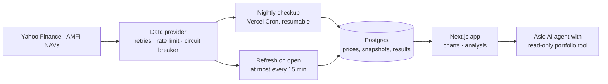

# Nazar · your portfolio, watched

> **Nazar tracks everything you own (stocks, mutual funds, ETFs, gold, US stocks, crypto, deposits) and explains what your money did and why, in plain words.**
> *It explains; you decide.*

**Live app:** https://nazar-watch.vercel.app (press **Try the demo**)

**Earlier version:** [StockAI (legacy)](https://stockai-legacy.vercel.app), on the [`legacy`](https://github.com/sakshamm21/Nazar/tree/legacy) branch.

---

## Why Nazar

Retail investors in India hold money in many places: a broker or two, a few mutual funds, gold, a PPF account, an FD. They can see prices everywhere, and still cannot answer simple questions:
- how much do I have in total, and how did it do this month?
- which holdings caused that, and how much was just the market?
- am I as diversified as I think?

Nazar puts everything in one place, keeps the prices fresh on its own, and answers those questions in sentences. It never tells anyone what to buy, sell or hold, and an automated test enforces that.

## Try it in a minute

1. Open the live app and press **Try the demo**. It signs you into a full account: 14 stocks plus funds, ETFs, a REIT, gold, US stocks, Bitcoin and deposits, and a second smaller portfolio.
2. **Home** is the glance: your value, today's change in one sentence, and a map of every holding coloured by how it moved.
3. **Portfolio → Overview**: drag along the value chart, tap the allocation ring, sort the holdings table. **Manage** is where you add, change or remove holdings and portfolios.
4. **Analysis**: pick a period and read what moved, why, and how it compares with the Nifty; then returns, risk and health.
5. **Ask** a question about your portfolio.

Signing in is required. See [the test accounts](#test-accounts) below.

## Features

| Screen | What it does |
|---|---|
| **Home** | Total value with today's change, one sentence on what caused it, and a heatmap of every holding: bigger tile, more of your money; green rose, red fell. |
| **Portfolio · Overview** | A value chart you can drag through (1 week to 1 year, against the Nifty), an allocation ring, today's biggest movers, sector mix, a health summary and a sortable table of every holding. |
| **Portfolio · Manage** | One search across stocks, ETFs, mutual funds, REITs and InvITs, gold and silver, US stocks and crypto; add several at once, or add deposits, PPF, EPF, NPS, bonds, property and cash at the value you enter. Import a holdings file from Zerodha, Groww or Upstox (CSV/Excel) or a mutual fund statement from CAMS / KFintech (PDF). Create, rename and delete portfolios, and keep a "Watching" list. |
| **Analysis** | Pick a period (today to a year): what the portfolio did, which holdings did it, how much was simply the market, and how the ride went against the Nifty. Below that: what stands out right now, gains and losses since you invested, a stress test, concentration, hidden clusters of holdings that move together, and the health of what you own. |
| **Stock page** | Price history, risk and return, and the latest quarter explained: what improved and what got worse. |
| **Ask** | An AI research assistant with 25 tools over live market data and read-only access to your portfolio. It is the only part of Nazar that uses an AI model. |
| **You** | Your profile, what you track at a glance, theme, password change, sign out and account deletion. |
| **Insights** (admin only, `/insights`) | Product numbers for the owner: people who track a portfolio and came back this week, the path from sign-up to reading the analysis, which screens are used, what people track, Ask quality and cost, and whether the market data is current. |

Nazar sends email for two things only: the code that confirms your address, and a password reset link.

## How it works



- **Pages never call the market-data provider.** Each evening the checkup fetches the data for everything someone holds once, stores a snapshot, and computes beta and a financial-health score from the stored data. Pages read only from the database, so they are fast and keep showing the last known prices when a data source is down.
- **Built for free-tier limits.** Vercel's free plan runs each cron job once a day and stops functions at 300 seconds. So the checkup is a resumable state machine: it keeps a lock, a cursor and a 240-second budget, and three evening runs each continue where the last one stopped. Every write is idempotent, so a re-run never duplicates anything.
- **Every asset class from free sources.** Exchange-traded assets come from Yahoo; mutual fund NAVs from AMFI's daily file (history from mfapi.in); gold and silver per gram from the international price and USD/INR plus import duty; US stocks and crypto from Yahoo's dollar price converted to rupees at the day's rate. Deposits, provident funds, property and cash are valued at what you enter, plus interest at the rate you give.
- **Refresh on open.** Opening the app makes one batched quote call for that user's holdings, at most every 15 minutes, stored exactly as the nightly checkup stores it.
- **Analysis from arithmetic, not a model.** The value history prices what you hold today on each past day. A period's change is split by holding and by asset type, and into "the market" (each holding's start value × its beta × the Nifty's move) and "specific to what you own". The sentences are fixed templates over those numbers, so every one is reproducible and tested. Purchases and sales along the way are not replayed, and the screens say so.
- **No advice, enforced.** A guard with English, Hindi and Hinglish patterns checks every generated sentence and every string in the interface, in a test that fails the build.
- **No captured or hand-written market data.** The test accounts are ordinary accounts on the same live sources as everyone else; only their choice of holdings is written down.

- **Functions run next to the database.** The free Neon database is in AWS us-east-1, so Vercel functions run in `iad1` too. A page pays the long hop to India once per request instead of once per query.
- **One rupee view.** Everything is held and shown in rupees. A US stock or a coin is converted at the day's dollar rate, so its value here moves with both its price and the rupee.
- **Deliberately not built.** Alerts, email digests and family reports (an earlier version had them; they were removed in favour of the Analysis screen), analyst ratings and target prices (they are recommendations), and live intraday prices (a daily tracker, not a trading screen).

## Tech stack

| Area | Choice |
|---|---|
| App | Next.js 16 (App Router), React 19, TypeScript |
| UI | Tailwind CSS 4 with design tokens, motion, Recharts, lucide icons. Fonts: Sora, Inter, IBM Plex Mono, Noto Sans Devanagari |
| Data | PostgreSQL with Drizzle ORM: Neon in production, PGlite (Postgres in WebAssembly) for local development and tests |
| Market data | Yahoo Finance via `yahoo-finance2`, AMFI NAVs, mfapi.in, the NSE equity and ETF lists, Google News RSS |
| Auth | Email and password (bcrypt), a 6-digit email code, a signed session cookie (JWT) |
| Email | Brevo HTTP API (free tier) |
| AI | Vercel AI SDK with OpenAI, in the Ask tab only |
| Jobs | Vercel Cron |
| Testing | Vitest (unit and integration), Playwright (end to end) |
| Hosting | Vercel |

Running cost is zero apart from light OpenAI use in Ask, which has per-user and daily spending caps.

## Project structure

```
src/
  app/                    Pages and API routes (Next.js App Router)
    (app)/                Signed-in app: home, portfolio, analysis, risk, stock, ask, settings
    (auth)/               Sign in, sign up, verify, forgot and reset password
    api/                  JSON API, the Ask stream, and the cron jobs
    page.tsx              Landing page
  components/             UI by area (home, portfolio, analysis, ask, landing, …) plus shared ui/, rings/, charts/
  lib/
    portfolio/            Portfolio maths: P&L, XIRR, attribution, performance over a period, stress test, clusters, concentration, and the sentences that describe them
    analytics/            Quant models: health score, beta, correlation, comps, DuPont, SIP, technicals
    pipeline/             The nightly checkup: collect, evaluate, deliver, first look for new stocks
    data/                 Market-data provider (Yahoo) with retries, rate limiting and a circuit breaker
    market/               Reading stored prices and snapshots for a portfolio and a day
    importers/            Broker file parsers (Zerodha, Groww, Upstox), mutual fund statements (CAMS / KFintech PDF) and symbol resolution
    demo/                 Test accounts (personas on live data)
    ask/                  The Ask assistant: tools, prompt, topic filter, model catalog
    auth/  email/  db/    Accounts and sessions, email templates and sending, schema and connection
    repo/  views/         Data access per user, and view models for pages
  data/                   Search lists: NSE equities, ETFs, REITs and InvITs, and AMFI mutual fund schemes
drizzle/                  Database migrations
scripts/                  Local dev, migrations, local reset, pipeline run, list refresh, guard evaluation
tests/
  unit/                   Pure logic: maths, performance analysis, importers, news filter, auth, contrast, no-advice
  integration/            Real SQL on in-memory Postgres: pipeline, authorization, test accounts, assets, first look
  e2e/                    Browser click-through of every hero flow
```

## Design

Dark ink-navy by default with a porcelain light theme, a cobalt accent, and a pink-to-cyan gradient kept for the one word or number that matters on a screen. Concentric rings, after the *nazar* amulet, are the only brand shape, and each one has a job:
- the logo;
- the portfolio-health gauge (outer ring: financial health, inner ring: diversification);
- the "Nazar is watching" status;
- loading states;
- calm empty states;

Type has two voices: Sora for headings and Inter for text and numbers, with IBM Plex Mono for tickers. Every colour is a token in `src/app/globals.css`, tested for WCAG AA contrast in both themes. The layout is mobile-first with bottom tabs, and gains and losses always carry a sign and an arrow, never colour alone. The live style guide is at `/design`.

## Test accounts

Signing in is required. **Try the demo** on the landing and sign-in pages signs into the first account below in one tap. The others sign in through the form (password `nazar123` for all).

| Account | What it holds |
|---|---|
| `demo@nazar.dev` · Aarav, the investor | 14 stocks, three mutual funds, two ETFs, a REIT, a Sovereign Gold Bond, Apple, Microsoft, Bitcoin, an FD, PPF and EPF; plus a second portfolio, "Dividend basket" (stocks, a fund, jewellery, a post office deposit, savings) |
| `riya@nazar.dev` · Riya, the saver | Five mutual funds, three ETFs, a REIT, gold, silver, a US index fund, Ethereum, three stocks, an FD, PPF, EPF, NPS, a bond and an emergency fund |
| `tester1@nazar.dev` · Kabir | A separate copy of the investor |
| `tester2@nazar.dev` · Meera | A separate copy of the saver |
| `new@nazar.dev` · Isha | Empty, for building a portfolio from scratch |

Things to know:
- They run on live data like any account: prices refresh when you open the app and every evening.
- Each has about 45 sessions of stored price history, so charts and analysis have something to show from the first visit.
- They are shared, and put back to their starting state once a day.
- Their names and passwords can't be changed, they can't be deleted, and they never send email.

## Run it locally

Requires **Node.js 22 or newer**. The same commands work on Windows, macOS and Linux.

```bash
npm install
npm run dev
```

Open http://localhost:3000 and press **Try the demo**.

No database or API keys are needed, only an internet connection. Without a database URL, `npm run dev` creates an embedded Postgres in `.data/nazar`, applies the migrations, and builds the test accounts from live market data (about a minute the first time). To enable optional features, copy `.env.example` to `.env.local`:

| Feature | Variable |
|---|---|
| Ask tab | `OPENAI_API_KEY` |
| Real email (sign-up codes and password resets) | `BREVO_API_KEY`, `MAIL_FROM` |

Every variable is documented, one per line, in `.env.example`.

### Commands

| Command | What it does |
|---|---|
| `npm run dev` | Run the app locally with the test accounts |
| `npm test` | Unit and integration tests (206 tests, about 20 seconds) |
| `npm run test:e2e` | Playwright click-through of every hero flow, on its own database |
| `npm run lint` · `npm run typecheck` | ESLint and TypeScript checks |
| `npm run demo:reset` | Rebuild the local database and test accounts (stop `npm run dev` first) |
| `npm run pipeline:run` | Run the nightly checkup now, against live market data |
| `npm run eval:guard` | Measure the Ask topic filter's precision and recall (needs `npm run dev` and an OpenAI key) |
| `npm run db:generate` | Create a migration after changing `src/lib/db/schema.ts` |
| `npm run nse:refresh` · `npm run catalog:refresh` | Refresh the search lists: NSE equities, and ETFs, REITs and mutual funds |

## Testing

- **Unit tests** cover the logic that decides what users are told:
  - broker file parsing, mutual fund statements (PDF) and symbol resolution;
  - portfolio maths and the quant models;
  - the news relevance filter and the retry and circuit-breaker logic;
  - sessions and signed links;
  - WCAG AA contrast of every colour token in both themes.
- **Integration tests** run the real SQL on an in-memory Postgres:
  - the full nightly checkup against a fake market, including re-runs, market holidays, new results and a provider outage;
  - authorization through the real API routes: another user's data always returns 404 and is never changed;
  - the test accounts: built on a fake live market, holding every asset class, put back nightly, with copies that never share state.
- **The no-advice test** checks every generated sentence (the day's explanation, the analysis, results, emails) and every user-visible string in the code.
- **End-to-end tests** drive a real browser through the landing page, the demo, Home, both Portfolio tabs (including creating, renaming and deleting a portfolio), Analysis, Ask, the profile, sign-up with a broker import and the mobile tabs.

## Deploy your own

1. Create a free Postgres database (for example on Neon) and a free Brevo account with a verified sender.
2. Import the repository on Vercel and set at least `NAZAR_DATABASE_URL`, `AUTH_SECRET`, `CRON_SECRET`, `BREVO_API_KEY`, `MAIL_FROM` and `OPENAI_API_KEY`.
3. Deploy. The build applies migrations and builds the test accounts from live data. `vercel.json` schedules the nightly checkup (weekday evenings IST) and the nightly maintenance.

## Disclaimer

Nazar is not a SEBI-registered investment adviser and never tells you what to do with your money. Market data comes from Yahoo Finance and AMFI and may be delayed or occasionally wrong.
