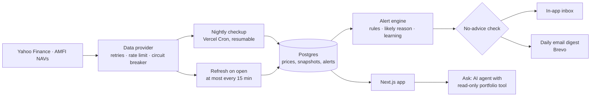

# Nazar · your portfolio watchdog

> **Nazar watches your Indian stocks every day and tells you only when something important happens: what happened, why, and what it means for you in rupees.**
> *We watch and explain; you decide.*

**Live app:** https://nazar-watch.vercel.app (press **Try the demo**)

**Earlier version:** [StockAI (legacy)](https://stockai-legacy.vercel.app), on the [`legacy`](https://github.com/sakshamm21/Nazar/tree/legacy) branch.

---

## Why Nazar

Retail investors in India often hold 10–20 stocks across brokers. They check prices daily, yet still miss what matters:
- a disappointing quarterly result;
- one stock quietly growing to a third of the portfolio;
- five "different" holdings that all fall together on bad days.

Nazar runs a checkup on every portfolio each evening after the market closes. It turns that checkup into a handful of plain-language alerts, in English or Hindi. It explains; it never tells anyone what to buy, sell or hold, and an automated test enforces that.

## Try it in a minute

1. Open the live app, press **Sign in**, then **Aarav, the investor**. He has two portfolios: "My portfolio" (14 stocks plus funds, ETFs, a REIT, gold and deposits), and "Papa's portfolio" with reports in Hindi. A short guided tour shows you around.
2. Press **Simulate a bad day**. The Nifty falls 3.2%, autos and IT fall harder, and one of your stocks has bad news of its own. Alerts arrive, each with the likely reason for the move and what it cost you.
3. Open **Risk** and drag the stress-test slider. Then open **You** to see your profile and the alert threshold Nazar learned from past 👍/👎 ratings, with the evidence and an Undo button.

Signing in is required: there is no anonymous demo. See [the test accounts](#test-accounts) below.

## Features

| | Feature | What it does |
|---|---|---|
| **H1** | Smart alerts | Big moves, results, health changes, concentration and your own price levels. Each alert gives the *likely reason* (whole market, sector, results or company-specific) and the ₹ impact on your portfolio. |
| **H2** | "Why did my portfolio move today?" | Names the fewest holdings that explain most of the day's move, and splits each into a market part and a stock-specific part. |
| **H3** | Hidden-risk checks | A stress-test slider (Nifty −5% to −30%), groups of holdings that move together ("you own 14 stocks but they behave like 3.3"), and concentration by stock and sector. |
| **H4** | Results-day explainer | What improved and what got worse in the latest quarter, in plain words, with the company's health score stated honestly. |
| **H5** | Alerts that learn | 👍/👎 on alerts. When small alerts keep getting 👎, Nazar raises the threshold, tells you why with the evidence, and lets you undo it. |
| **H6** | Family portfolios in Hindi | Track a parent's portfolio separately. A confirmed family member gets a Sunday report and the important alerts by email, in Hindi. |
| | Analyzer | On the Alerts page: pick a period (today to a year) and read what the portfolio did, why (which holdings, and how much was simply the market) and how the ride went against the Nifty. |
| | Interactive charts | Home opens on a value chart you can drag through, an allocation ring and a heatmap of every holding. |
| | Demo | One "Try the demo" button signs into a full account on live data, with "Simulate a bad day". Four more test accounts exist for testers. |
| | Profile | Your name, email, what you track at a glance, password change and account deletion, under **You**. |
| | Portfolios | One search across stocks, ETFs, mutual funds, REITs and InvITs, gold and silver, US stocks and crypto; add several at once, or add deposits, PPF, EPF, NPS, bonds, property and cash at the value you enter. Import a holdings file from Zerodha, Groww or Upstox (CSV/Excel) or a mutual fund statement from CAMS / KFintech (PDF), keep a "Watching" list, set price levels. Prices refresh when you open the app. |
| | Ask | An AI research assistant with 28 tools over live market data and read-only access to your portfolio. It opens with a guided start: how it works, and example questions by topic that name your own holdings. It is the only part of Nazar that uses an AI model. |

## How it works



- **Pages never call the market-data provider.** Each evening the checkup does the following for everything someone holds:
  1. fetches its data once;
  2. stores a snapshot;
  3. computes beta and a financial-health score from the stored data;
  4. runs the alert rules;
  5. delivers the alerts.

  Pages read only from the database, so they are fast and keep showing the last known prices when a data source is down.
- **Built for free-tier limits.** Vercel's free plan runs each cron job once a day and stops functions at 300 seconds. So the checkup is a resumable state machine: it keeps a lock, a cursor and a 240-second budget, and three evening runs each continue where the last one stopped. Every write is idempotent, so a re-run never duplicates an alert or an email.
- **Every asset class from free sources.** Exchange-traded assets come from Yahoo; mutual fund NAVs from AMFI's daily file (history from mfapi.in); gold and silver per gram from the international price and USD/INR plus import duty; US stocks and crypto from Yahoo's dollar price converted to rupees at the day's rate. Deposits, provident funds, property and cash have no price feed, so they hold the value the user entered and grow at the rate the user gave.
- **Refresh on open.** Opening the app makes one batched quote call for that user's holdings, at most every 15 minutes, stored exactly as the nightly checkup stores it. Pages still read only from the database, and alerts are still decided once a day.
- **Explainable rules, not a black box.** The "likely reason" compares a stock's move with the Nifty × its beta and with its sector index. A fund, gold, a US stock or a coin is never called "company-specific": it is either the market, or its own market, with a plain sentence saying which. The learning step raises a threshold only when your ratings clearly separate useful alerts from the rest.
- **No advice, enforced.** Alerts and reports come from fixed templates, not from an AI model, so every sentence is reproducible and testable. A guard with English, Hindi and Hinglish patterns checks every alert, report and email before it is saved or sent.
- **No captured or hand-written market data.** The test accounts are ordinary accounts on the same live sources as everyone else. When one is first built, the real alert engine is replayed over the last 45 real market sessions and the real tuner learns from the persona's ratings, so its history is genuine. Only "Simulate a bad day" is generated, and it is labelled as a simulation everywhere it appears.

- **Functions run next to the database.** The free Neon database is in AWS us-east-1, so Vercel functions run in `iad1` too. A page pays the long hop to India once per request instead of once per query.
- **One rupee view.** Everything is held and shown in rupees. A US stock or a coin is converted at the day's dollar rate, so its value here moves with both its price and the rupee.
- **Deliberately not built.** Analyst ratings and target prices (they are recommendations), dividend alerts (Yahoo's NSE dividend dates are unreliable), live intraday prices (a daily watchdog, not a trading screen), and Telegram, WhatsApp or push notifications (more outside services to run).

## Tech stack

| Area | Choice |
|---|---|
| App | Next.js 16 (App Router), React 19, TypeScript |
| UI | Tailwind CSS 4 with design tokens, motion, Recharts, lucide icons. Fonts: Big Shoulders, DM Serif Display, Outfit, Space Grotesk, Space Mono, Noto Sans Devanagari |
| Data | PostgreSQL with Drizzle ORM: Neon in production, PGlite (Postgres in WebAssembly) for local development and tests |
| Market data | Yahoo Finance via `yahoo-finance2`, AMFI NAVs, mfapi.in, the NSE equity and ETF lists, Google News RSS |
| Auth | Email and password (bcrypt), a 6-digit email code, a signed session cookie (JWT) |
| Email | Brevo HTTP API (free tier) |
| AI | Vercel AI SDK with OpenAI, in the Ask tab only |
| Jobs | Vercel Cron |
| Testing | Vitest (unit and integration), Playwright (end to end) |
| Hosting | Vercel |

Running cost is zero apart from light OpenAI use in Ask, which has per-user and daily spending caps.

## Project structure

```
src/
  app/                    Pages and API routes (Next.js App Router)
    (app)/                Signed-in app: home, alerts, risk, portfolio, stock, reports, settings, ask
    (auth)/               Sign in, sign up, verify, forgot and reset password
    api/                  JSON API, the Ask stream, and the cron jobs
    page.tsx              Landing page
  components/             UI by area (home, alerts, risk, portfolio, ask, …) plus shared ui/, rings/, charts/
  lib/
    alerts/               Alert rules, likely reason, templates (EN/HI), learning, routing, no-advice guard
    portfolio/            Portfolio maths: P&L, XIRR, attribution, stress test, clusters, concentration
    analytics/            Quant models: health score, beta, correlation, comps, DuPont, SIP, technicals
    pipeline/             The nightly checkup: collect, evaluate, deliver, first look for new stocks
    data/                 Market-data provider (Yahoo) with retries, rate limiting and a circuit breaker
    market/               Reading stored prices and snapshots for a portfolio and a day
    importers/            Broker file parsers (Zerodha, Groww, Upstox), mutual fund statements (CAMS / KFintech PDF) and symbol resolution
    reports/              Weekly reports (EN/HI)
    demo/                 Test accounts (personas on live data) and "Simulate a bad day"
    ask/                  The Ask assistant: tools, prompt, topic filter, model catalog
    auth/  email/  db/    Accounts and sessions, email templates and sending, schema and connection
    repo/  views/         Data access per user, and view models for pages
  data/                   Search lists: NSE equities, ETFs, REITs and InvITs, and AMFI mutual fund schemes
drizzle/                  Database migrations
scripts/                  Local dev, migrations, local reset, pipeline run, list refresh, guard evaluation
tests/
  unit/                   Pure logic: alerts, maths, importers, news filter, auth, contrast, no-advice
  integration/            Real SQL on in-memory Postgres: pipeline, authorization, test accounts, assets, first look
  e2e/                    Browser click-through of every hero flow
```

## Design

Dark ink-navy by default with a porcelain light theme, a cobalt accent, and a pink-to-cyan gradient kept for the one word or number that matters on a screen. Concentric rings, after the *nazar* amulet, are the only brand shape, and each one has a job:
- the logo;
- the portfolio-health gauge (outer ring: financial health, inner ring: diversification);
- the "Nazar is watching" status;
- loading states;
- calm empty states;
- alert severity, shown by shape as well as colour.

Type has five voices: Big Shoulders (condensed capitals) for headings, DM Serif Display italic for the emphasised word in a headline, Outfit for text and Space Grotesk for every number, with Space Mono for labels and tickers and Noto Sans Devanagari for Hindi. Every colour is a token in `src/app/globals.css`, tested for WCAG AA contrast in both themes. The layout is mobile-first with bottom tabs, and gains and losses always carry a sign and an arrow, never colour alone. The live style guide is at `/design`.

## Test accounts

Signing in is required. **Try the demo** on the landing and sign-in pages signs into the first account below in one tap. The others sign in through the form (password `nazar123` for all).

| Account | What it holds |
|---|---|
| `demo@nazar.dev` · Aarav, the investor | 14 stocks, three mutual funds, two ETFs, a REIT, a Sovereign Gold Bond, Apple, Microsoft, Bitcoin, an FD, PPF and EPF; plus "Papa's portfolio" in Hindi (stocks, a fund, jewellery, a post office deposit, savings) |
| `riya@nazar.dev` · Riya, the saver | Five mutual funds, three ETFs, a REIT, gold, silver, a US index fund, Ethereum, three stocks, an FD, PPF, EPF, NPS, a bond and an emergency fund |
| `tester1@nazar.dev` · Kabir | A separate copy of the investor |
| `tester2@nazar.dev` · Meera | A separate copy of the saver |
| `new@nazar.dev` · Isha | Empty, for building a portfolio from scratch |

Things to know:
- They run on live data like any account: prices refresh when you open the app and every evening.
- Each has about 45 sessions of real alert history, a learned threshold, weekly reports and "Simulate a bad day".
- They are shared, and put back to their starting state once a day.
- Their names and passwords can't be changed, they can't be deleted, and they never send email.

## Run it locally

Requires **Node.js 22 or newer**. The same commands work on Windows, macOS and Linux.

```bash
npm install
npm run dev
```

Open http://localhost:3000 and press **Try the demo**.

No database or API keys are needed, only an internet connection. Without a database URL, `npm run dev` creates an embedded Postgres in `.data/nazar`, applies the migrations, and builds the test accounts from live market data (about a minute the first time). To enable optional features, copy `.env.example` to `.env.local`:

| Feature | Variable |
|---|---|
| Ask tab | `OPENAI_API_KEY` |
| Real email | `BREVO_API_KEY`, `MAIL_FROM` |

Every variable is documented, one per line, in `.env.example`.

### Commands

| Command | What it does |
|---|---|
| `npm run dev` | Run the app locally with the test accounts |
| `npm test` | Unit and integration tests (250 tests, about 30 seconds) |
| `npm run test:e2e` | Playwright click-through of every hero flow, on its own database |
| `npm run lint` · `npm run typecheck` | ESLint and TypeScript checks |
| `npm run demo:reset` | Rebuild the local database and test accounts (stop `npm run dev` first) |
| `npm run pipeline:run` | Run the nightly checkup now, against live market data |
| `npm run eval:guard` | Measure the Ask topic filter's precision and recall (needs `npm run dev` and an OpenAI key) |
| `npm run db:generate` | Create a migration after changing `src/lib/db/schema.ts` |
| `npm run nse:refresh` · `npm run catalog:refresh` | Refresh the search lists: NSE equities, and ETFs, REITs and mutual funds |

## Testing

- **Unit tests** cover the logic that decides what users are told:
  - broker file parsing, mutual fund statements (PDF) and symbol resolution;
  - portfolio maths and the quant models;
  - every alert rule, the likely reason and de-duplication;
  - the learning step and family routing;
  - the news relevance filter and the retry and circuit-breaker logic;
  - sessions and signed links;
  - WCAG AA contrast of every colour token in both themes.
- **Integration tests** run the real SQL on an in-memory Postgres:
  - the full nightly checkup against a fake market, including re-runs, market holidays, new results and a provider outage;
  - authorization through the real API routes: another user's data always returns 404 and is never changed;
  - the test accounts: built on a fake live market, holding every asset class, put back nightly, and simulated.
- **The no-advice test** checks the alert engine across 90 scenarios, every template, the weekly reports and emails in both languages, and every user-visible string in the code.
- **End-to-end tests** drive a real browser through the tour, Simulate, every hero feature, sign-up with a broker import, the mobile tabs and an Ask answer.

## Deploy your own

1. Create a free Postgres database (for example on Neon) and a free Brevo account with a verified sender.
2. Import the repository on Vercel and set at least `NAZAR_DATABASE_URL`, `AUTH_SECRET`, `CRON_SECRET`, `BREVO_API_KEY`, `MAIL_FROM` and `OPENAI_API_KEY`.
3. Deploy. The build applies migrations and builds the test accounts from live data. `vercel.json` schedules the nightly checkup (weekday evenings IST), the Sunday reports and the nightly maintenance.

## Disclaimer

Nazar is not a SEBI-registered investment adviser and never tells you what to do with your money. Market data comes from Yahoo Finance and AMFI and may be delayed or occasionally wrong.
