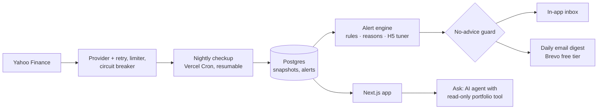

# Nazar · your portfolio watchdog

> **Nazar watches your Indian stocks every day and messages you only when something important happens, explaining what happened, why, and what it means for you in rupees.**
> *We watch and explain; you decide.*

**Live:** __LIVE_URL__ · press **Try the demo**, no sign-up · [StockAI v1 (legacy)](__LEGACY_URL__)

Retail investors in India hold 10–20 stocks across brokers, check the app daily, and still miss what matters: a results surprise, a stock quietly becoming a third of the portfolio, five "different" holdings that all fall together. Nazar runs a checkup on every portfolio each evening after the market closes and turns it into a handful of plain-language alerts in English or Hindi. It never tells anyone to buy, sell or hold, and a test enforces that.

| | |
|---|---|
| **Hero features** | Smart alerts with a likely reason and ₹ impact · "Why did my portfolio move today?" · hidden-risk checks (stress test, correlation clusters, concentration) · results-day explainer · alerts that learn from 👍/👎 · family portfolios with Hindi reports |
| **Demo** | "Simulate a bad day" runs the real alert engine on a generated market scenario; a 7-step guided tour; seeded with real NSE data; works with Yahoo Finance down |
| **Quality** | 203 Vitest tests (unit + integration on real Postgres via PGlite) · 15 Playwright end-to-end flows in Edge · WCAG AA contrast test · a no-advice test over every generated sentence and every UI string |
| **Running cost** | ₹0 apart from light OpenAI use in the Ask tab. Alerts, reports and Hindi text are deterministic templates, not LLM output |

## Try it in 60 seconds

1. Open __LIVE_URL__ and press **Try the demo**. You get a private 24-hour copy of a two-portfolio demo account (yours, and "Papa's" in Hindi).
2. The tour walks through Home. Then press **Simulate a bad day**: the Nifty falls 3.2%, autos and IT fall harder, and one of your stocks has bad news of its own. Alerts arrive with the likely reason for each move and what it cost you.
3. Open **Risk** and drag the stress slider; open **Settings** to see the threshold Nazar learned from past ratings, with the evidence and an Undo button.

Prefer a fixed account? Sign in with one click on the sign-in page, or use the logins in [TEST_ACCOUNTS.md](TEST_ACCOUNTS.md).

## How it works



- **Pages never call Yahoo.** A nightly pipeline fetches each held symbol once, stores snapshots, computes beta and health scores from stored data, evaluates the alert rules and delivers. Pages read only from Postgres, so they are fast and keep working when Yahoo doesn't.
- **Built for Vercel Hobby limits.** Crons run once a day per entry and functions stop at 300s, so the pipeline is a resumable state machine (lock row, cursor, 240s budget, three daily cron entries). Every write is idempotent; re-runs are safe.
- **Explainable rules, not a black box.** "Likely reason" compares the move with the Nifty × beta and the sector index; the learning step raises a threshold only when your ratings clearly separate useful from not useful, and says so with the evidence.
- **The demo is honest.** Real NSE prices captured into a fixture, date-shifted to "last session"; 60 sessions of history produced by replaying the real alert engine, not hand-written.

The full design is in [PLAN.md](PLAN.md); the trade-offs are in [DECISIONS.md](DECISIONS.md).

## Engineering highlights

- **No-advice enforcement as code.** A guard with English, Hindi and Hinglish patterns runs on every alert, report and email at runtime, and a test runs it over a 90-scenario matrix of the alert engine plus every string literal in the UI.
- **Broker imports** from Zerodha Console, Zerodha Kite, Groww and Upstox (CSV or XLSX), detected by headers and resolved to NSE symbols through ISIN, symbol, alias (e.g. ZOMATO → ETERNAL) and name matching against the NSE master list.
- **Portfolio maths you can check**: XIRR against the same rupees in the Nifty on the same dates, attribution that names the fewest holdings explaining ≥ 60% of a day's move, Blume-adjusted beta stress tests, average-linkage correlation clusters, effective number of independent bets.
- **Authorization tested through the real route handlers**: another user's portfolio, holding, alert, threshold or price level returns 404 and stays unchanged.
- **Accessibility**: colour tokens tested for 4.5:1 in both themes, keyboard focus, reduced-motion support, mobile-first layout with bottom tabs, checked at 375/768/1440 px.

## Stack

Next.js 16 (App Router, Turbopack) · React 19 · TypeScript · Tailwind CSS 4 · Drizzle ORM on Postgres (Neon in production, PGlite locally) · email + password + 6-digit code auth (bcrypt, JWT in an httpOnly cookie) · Brevo HTTP API for email · Vercel AI SDK 5 with OpenAI (Ask tab only) · Recharts · ExcelJS · pino · Vitest · Playwright.

## Run locally

Requires **Node 22+**. Works the same on Windows, macOS and Linux.

```bash
npm install
npm run dev          # http://localhost:3000
```

That's it: with no database URL, `npm run dev` creates an embedded Postgres (PGlite) in `.data/nazar`, migrates it, and seeds the demo market and test accounts from the committed fixture, so no network is needed. Sign in with `demo@nazar.dev` / `nazar123`. Ask needs `OPENAI_API_KEY` in `.env.local`; every other variable is optional and documented one per line in [.env.example](.env.example).

| Command | What it does |
|---|---|
| `npm run dev` | Local app with demo data |
| `npm test` | 203 unit + integration tests (~15 s) |
| `npm run test:e2e` | Playwright click-through of every hero flow in Edge/Chromium, on its own database |
| `npm run eval:guard` | Precision/recall of the Ask on-topic classifier (needs the dev server and an OpenAI key) |
| `npm run demo:reset` | Rebuild the local demo data |
| `npm run pipeline:run` | Run tonight's checkup now against live Yahoo data |
| `npm run build` | Migrate (if a database URL is set) and build for production |

## Deploying your own

1. Create a free Postgres database (Neon) and a free Brevo account with a verified sender.
2. Import the repo on Vercel and set `NAZAR_DATABASE_URL`, `AUTH_SECRET`, `CRON_SECRET`, `BREVO_API_KEY`, `MAIL_FROM` and `OPENAI_API_KEY` (see `.env.example`).
3. Deploy. The build runs migrations and seeds the demo; `vercel.json` schedules the nightly, weekly and maintenance jobs.

## Documentation

| File | Contents |
|---|---|
| [FEATURES.md](FEATURES.md) | Every feature: what the user sees, how it works, where the code and tests are |
| [DECISIONS.md](DECISIONS.md) | Architecture decisions and the trade-offs behind them |
| [TEST_ACCOUNTS.md](TEST_ACCOUNTS.md) | Logins for reviewers and testers |
| [CHANGELOG.md](CHANGELOG.md) | v2.0.0 (Nazar) and v1 (StockAI) |
| [DESIGN.md](DESIGN.md) | Design system: tokens, type, motion, voice |
| [AUDIT.md](AUDIT.md) · [PLAN.md](PLAN.md) | The v1 audit and the v2 build plan |

## Disclaimer

Nazar is not a SEBI-registered investment adviser and never tells you what to do with your money. Market data comes from Yahoo Finance via nightly checks and may be delayed or occasionally wrong.
