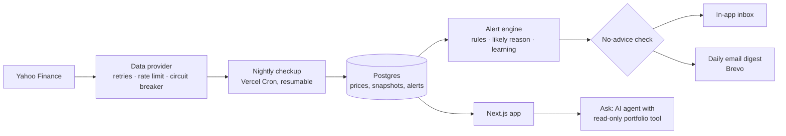

# Nazar · your portfolio watchdog

> **Nazar watches your Indian stocks every day and tells you only when something important happens: what happened, why, and what it means for you in rupees.**
> *We watch and explain; you decide.*

**Live app:** https://nazar-watch.vercel.app (press **Try the demo**, no sign-up needed)

**Earlier version:** [StockAI (legacy)](https://stockai-legacy.vercel.app), on the [`legacy`](https://github.com/sakshamm21/Nazar/tree/legacy) branch.

---

## Why Nazar

Retail investors in India often hold 10–20 stocks across brokers. They check prices daily, yet still miss what matters:
- a disappointing quarterly result;
- one stock quietly growing to a third of the portfolio;
- five "different" holdings that all fall together on bad days.

Nazar runs a checkup on every portfolio each evening after the market closes. It turns that checkup into a handful of plain-language alerts, in English or Hindi. It explains; it never tells anyone what to buy, sell or hold, and an automated test enforces that.

## Try it in a minute

1. Open the live app and press **Try the demo**. You get a private 24-hour copy of a demo account with two portfolios: "My portfolio", and "Papa's portfolio" with reports in Hindi. A short guided tour shows you around.
2. Press **Simulate a bad day**. The Nifty falls 3.2%, autos and IT fall harder, and one of your stocks has bad news of its own. Alerts arrive, each with the likely reason for the move and what it cost you.
3. Open **Risk** and drag the stress-test slider. Then open **Settings** to see the alert threshold Nazar learned from past 👍/👎 ratings, with the evidence and an Undo button.

Prefer a fixed login? The sign-in page has one-click test accounts (see [docs/TEST_ACCOUNTS.md](docs/TEST_ACCOUNTS.md)).

## Features

| | Feature | What it does |
|---|---|---|
| **H1** | Smart alerts | Big moves, results, health changes, concentration and your own price levels. Each alert gives the *likely reason* (whole market, sector, results or company-specific) and the ₹ impact on your portfolio. |
| **H2** | "Why did my portfolio move today?" | Names the fewest holdings that explain most of the day's move, and splits each into a market part and a stock-specific part. |
| **H3** | Hidden-risk checks | A stress-test slider (Nifty −5% to −30%), groups of holdings that move together ("you own 14 stocks but they behave like 3.3"), and concentration by stock and sector. |
| **H4** | Results-day explainer | What improved and what got worse in the latest quarter, in plain words, with the company's health score stated honestly. |
| **H5** | Alerts that learn | 👍/👎 on alerts. When small alerts keep getting 👎, Nazar raises the threshold, tells you why with the evidence, and lets you undo it. |
| **H6** | Family portfolios in Hindi | Track a parent's portfolio separately. A confirmed family member gets a Sunday report and the important alerts by email, in Hindi. |
| | Demo | "Try the demo" with no sign-up, "Simulate a bad day", a guided tour, real NSE data that works even when the data provider is down. |
| | Portfolios | Import from Zerodha, Groww or Upstox (CSV/Excel), add stocks by hand, keep a "Watching" list, set price levels. |
| | Ask | An AI research assistant with 28 tools over live market data and read-only access to your portfolio. It is the only part of Nazar that uses an AI model. |

Every feature is described in detail, with where its code and tests are, in [docs/FEATURES.md](docs/FEATURES.md).

## How it works



- **Pages never call the market-data provider.** Each evening the checkup does the following for every stock someone holds:
  1. fetches its data once;
  2. stores a snapshot;
  3. computes beta and a financial-health score from the stored data;
  4. runs the alert rules;
  5. delivers the alerts.

  Pages read only from the database, so they are fast and keep working when Yahoo Finance doesn't.
- **Built for free-tier limits.** Vercel's free plan runs each cron job once a day and stops functions at 300 seconds. So the checkup is a resumable state machine: it keeps a lock, a cursor and a 240-second budget, and three evening runs each continue where the last one stopped. Every write is idempotent, so a re-run never duplicates an alert or an email.
- **Explainable rules, not a black box.** The "likely reason" compares a stock's move with the Nifty × its beta and with its sector index. The learning step raises a threshold only when your ratings clearly separate useful alerts from the rest.
- **No advice, enforced.** Alerts and reports come from fixed templates, not from an AI model, so every sentence is reproducible and testable. A guard with English, Hindi and Hinglish patterns checks every alert, report and email before it is saved or sent.
- **An honest demo.** Real NSE prices are captured into a file and date-shifted so the latest session is always recent. The demo's 60 sessions of alert history were produced by replaying the real alert engine, not written by hand.

The reasoning behind these choices is in [docs/DECISIONS.md](docs/DECISIONS.md).

## Tech stack

| Area | Choice |
|---|---|
| App | Next.js 16 (App Router), React 19, TypeScript |
| UI | Tailwind CSS 4 with design tokens, motion, Recharts, lucide icons. Fonts: Sora, Inter, IBM Plex Mono, Noto Sans Devanagari |
| Data | PostgreSQL with Drizzle ORM: Neon in production, PGlite (Postgres in WebAssembly) for local development and tests |
| Market data | Yahoo Finance via `yahoo-finance2`, the NSE equity list, Google News RSS |
| Auth | Email and password (bcrypt), a 6-digit email code, a signed session cookie (JWT) |
| Email | Brevo HTTP API (free tier) |
| AI | Vercel AI SDK with OpenAI, in the Ask tab only |
| Jobs | Vercel Cron |
| Testing | Vitest (unit and integration), Playwright (end to end) |
| Hosting | Vercel |

Running cost is zero apart from light OpenAI use in Ask, which has per-user and daily spending caps.

## Project structure

```
src/
  app/                    Pages and API routes (Next.js App Router)
    (app)/                Signed-in app: home, alerts, risk, portfolio, stock, reports, settings, ask
    (auth)/               Sign in, sign up, verify, forgot and reset password
    api/                  JSON API, the Ask stream, and the cron jobs
    page.tsx              Landing page
  components/             UI by area (home, alerts, risk, portfolio, ask, …) plus shared ui/, rings/, charts/
  lib/
    alerts/               Alert rules, likely reason, templates (EN/HI), learning, routing, no-advice guard
    portfolio/            Portfolio maths: P&L, XIRR, attribution, stress test, clusters, concentration
    analytics/            Quant models: health score, beta, correlation, comps, DuPont, SIP, technicals
    pipeline/             The nightly checkup: collect, evaluate, deliver, first look for new stocks
    data/                 Market-data provider (Yahoo) with retries, rate limiting and a circuit breaker
    market/               Reading stored prices and snapshots for a portfolio and a day
    importers/            Broker file parsers (Zerodha, Groww, Upstox) and NSE symbol resolution
    reports/              Weekly reports (EN/HI)
    demo/                 Demo data, per-visitor demo accounts, "Simulate a bad day"
    ask/                  The Ask assistant: tools, prompt, topic filter, model catalog
    auth/  email/  db/    Accounts and sessions, email templates and sending, schema and connection
    repo/  views/         Data access per user, and view models for pages
  data/                   NSE equity list and the demo fixture (real captured prices)
drizzle/                  Database migrations
scripts/                  Local dev, migrations, demo reset, pipeline run, data refresh, guard evaluation
tests/
  unit/                   Pure logic: alerts, maths, importers, news filter, auth, contrast, no-advice
  integration/            Real SQL on in-memory Postgres: pipeline, authorization, demo, first look
  e2e/                    Browser click-through of every hero flow
docs/                     Features, decisions, design system, test accounts
```

## Run it locally

Requires **Node.js 22 or newer**. The same commands work on Windows, macOS and Linux.

```bash
npm install
npm run dev
```

Open http://localhost:3000 and sign in with `demo@nazar.dev` / `nazar123`.

No database or API keys are needed. Without a database URL, `npm run dev` creates an embedded Postgres in `.data/nazar`, applies the migrations, and loads the demo market and test accounts from the committed data file. To enable optional features, copy `.env.example` to `.env.local`:

| Feature | Variable |
|---|---|
| Ask tab | `OPENAI_API_KEY` |
| Real email | `BREVO_API_KEY`, `MAIL_FROM` |

Every variable is documented, one per line, in `.env.example`.

### Commands

| Command | What it does |
|---|---|
| `npm run dev` | Run the app locally with demo data |
| `npm test` | Unit and integration tests (206 tests, about 15 seconds) |
| `npm run test:e2e` | Playwright click-through of every hero flow, on its own database |
| `npm run lint` · `npm run typecheck` | ESLint and TypeScript checks |
| `npm run demo:reset` | Rebuild the local demo data (stop `npm run dev` first) |
| `npm run pipeline:run` | Run the nightly checkup now, against live market data |
| `npm run eval:guard` | Measure the Ask topic filter's precision and recall (needs `npm run dev` and an OpenAI key) |
| `npm run db:generate` | Create a migration after changing `src/lib/db/schema.ts` |
| `npm run demo:capture` · `npm run nse:refresh` | Refresh the demo data file and the NSE equity list from their sources |

## Testing

- **Unit tests** cover the logic that decides what users are told:
  - broker file parsing and symbol resolution;
  - portfolio maths and the quant models;
  - every alert rule, the likely reason and de-duplication;
  - the learning step and family routing;
  - the news relevance filter and the retry and circuit-breaker logic;
  - sessions and signed links;
  - WCAG AA contrast of every colour token in both themes.
- **Integration tests** run the real SQL on an in-memory Postgres:
  - the full nightly checkup against a fake market, including re-runs, market holidays, new results and a provider outage;
  - authorization through the real API routes: another user's data always returns 404 and is never changed;
  - the demo, built and simulated with the network switched off.
- **The no-advice test** checks the alert engine across 90 scenarios, every template, the weekly reports and emails in both languages, and every user-visible string in the code.
- **End-to-end tests** drive a real browser through the tour, Simulate, every hero feature, sign-up with a broker import, the mobile tabs and an Ask answer.

## Deploy your own

1. Create a free Postgres database (for example on Neon) and a free Brevo account with a verified sender.
2. Import the repository on Vercel and set at least `NAZAR_DATABASE_URL`, `AUTH_SECRET`, `CRON_SECRET`, `BREVO_API_KEY`, `MAIL_FROM` and `OPENAI_API_KEY`.
3. Deploy. The build applies migrations and loads the demo data. `vercel.json` schedules the nightly checkup (weekday evenings IST), the Sunday reports and the nightly maintenance.

## Documentation

| Document | Contents |
|---|---|
| [docs/FEATURES.md](docs/FEATURES.md) | Every feature: what the user sees, how it works, where the code and tests are |
| [docs/DECISIONS.md](docs/DECISIONS.md) | Architecture decisions and their trade-offs |
| [docs/DESIGN.md](docs/DESIGN.md) | Design system: colour tokens, type, components, motion and voice |
| [docs/TEST_ACCOUNTS.md](docs/TEST_ACCOUNTS.md) | Logins for reviewers and testers |
| [CHANGELOG.md](CHANGELOG.md) | What changed in each version |

## Disclaimer

Nazar is not a SEBI-registered investment adviser and never tells you what to do with your money. Market data comes from Yahoo Finance and may be delayed or occasionally wrong.
